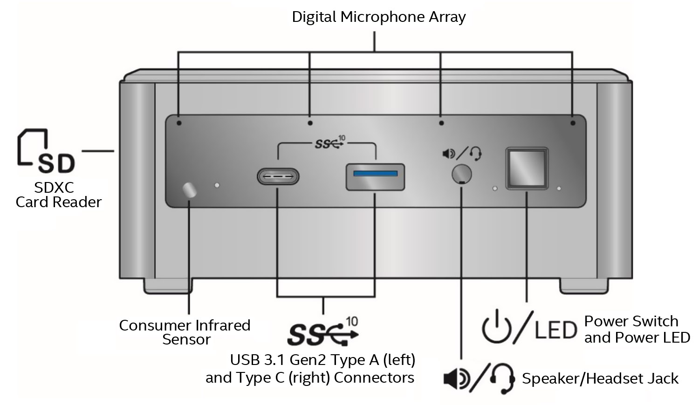
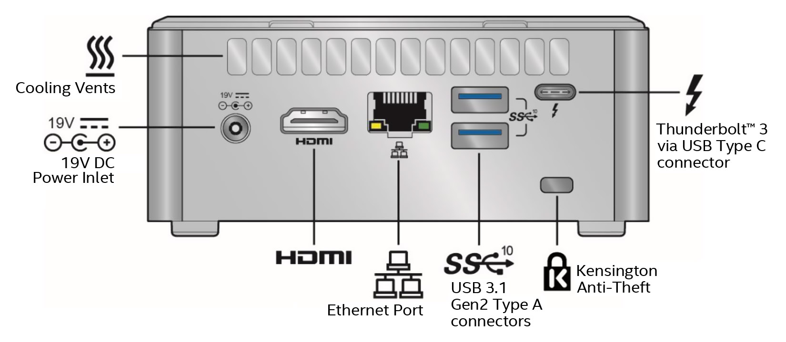
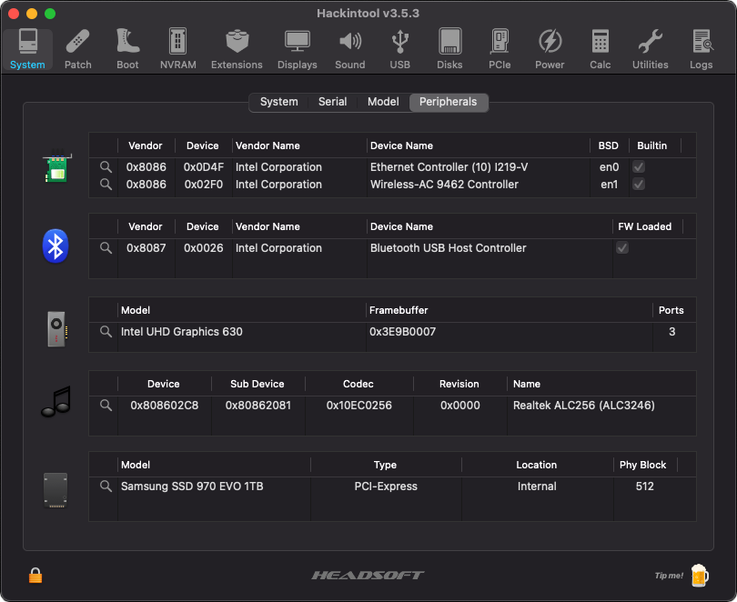
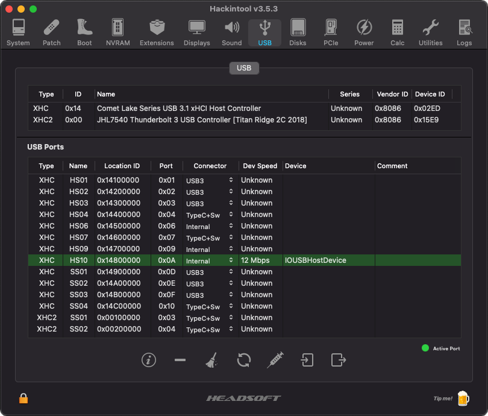
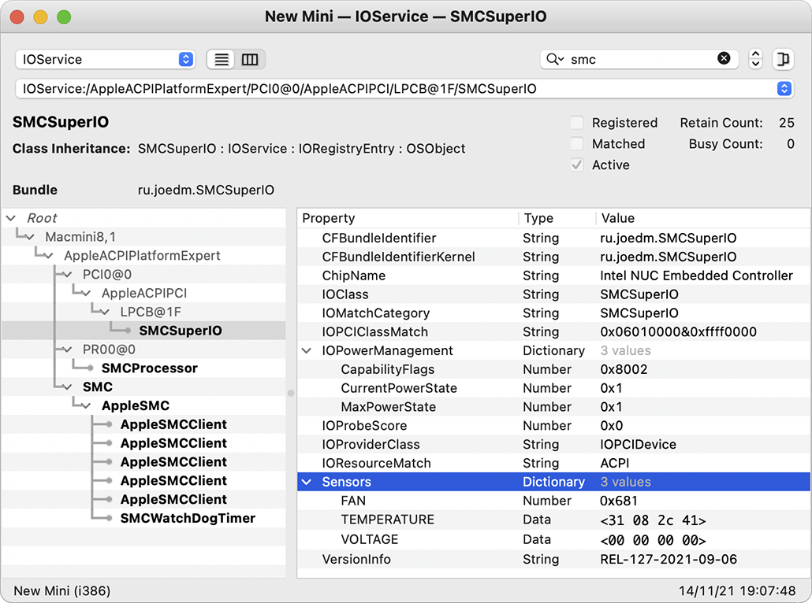
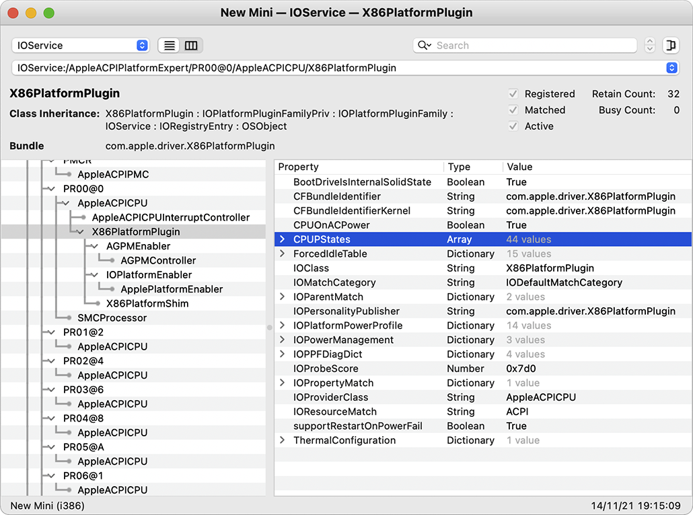
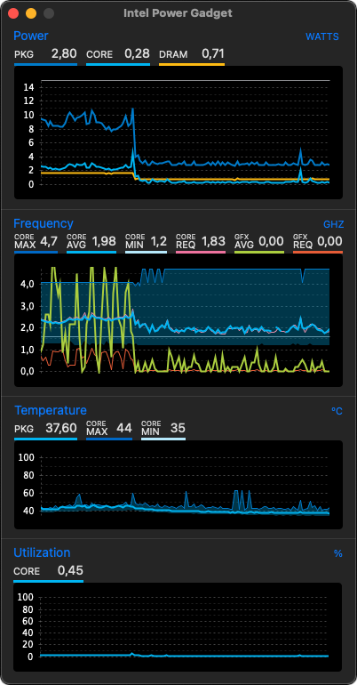

# Intel NUC Model NUC10i5FNH

This repository contains personal work and files, developed and maintained for a successful use with [OpenCore EFI bootloader](https://github.com/acidanthera/OpenCorePkg) on this specific Intel NUC model. There are **no** ready, pre-packaged EFI solutions provided; instead, the needed configuration and ACPI files are published for those interested in studying the code, while creating their own bootloader configurations.

* **Comet Lake = All Core ix-10xxx (UHD Graphics 6xx)**

## Product Generation: Frost Canyon (2019)

**Specifications:** see [Intel website](https://ark.intel.com/content/www/us/en/ark/products/189239/intel-nuc-10-performance-kit-nuc10i5fnh.html)

**Downloads:** see [Intel website](https://www.intel.com/content/www/us/en/products/sku/189239/intel-nuc-10-performance-kit-nuc10i5fnh/downloads.html)

**BIOS Update & Recovery Instructions:** see [Intel website](https://www.intel.com/content/www/us/en/support/articles/000033291/mini-pcs.html)

**BIOS Troubleshooting:** see [Intel website](https://www.intel.com/content/www/us/en/support/articles/000005964/mini-pcs.html)

## Processor Generation: Comet Lake (2019)

**CPU:** Intel Core i5-10210U @ 1.60 GHz up to 4.20 GHz / 4 Cores / 8 Threads

**GPU:** Intel® UHD Graphics for 10th Gen Intel® Processors | Intel UHD 630 Graphics / 300 MHz up to 1.10 GHz

**Specifications:** see [Intel website](https://ark.intel.com/content/www/us/en/ark/products/195436/intel-core-i510210u-processor-6m-cache-up-to-4-20-ghz.html)

## Product Overview

## Compatible Models

Mac Model: **Macmini8,1** 
CPU: i7-8700B @ 3.20 GHz up to 4.60 GHz / 6 Cores / 12 Threads 
GPU: Intel UHD Graphics 630 
Everymac: https://everymac.com/ultimate-mac-lookup/?search_keywords=Macmini8,1 

## Required BIOS Settings

For the most basic but _required_ BIOS settings, as well as previous firmware releases, see [BIOS](BIOS/) folder.

## OpenCore Picker Keyboard Shortcuts

When the `Timeout` key is set and OpenCore Picker displays the available boot drives:

* Press **Space Bar** to access the hidden _Auxiliary_ tools e.g. UEFI Shell, NVRAM Cleanup, Verify MSR Lock.
* Press **Tab** to move selection to the newly available Reboot and Shutdown icons (since OpenCore 0.6.8).

Alternatively, if `ShowPicker` is disabled or `Timeout` set to 0, keep pressing **Escape** or **Zero** or **Option** keys to access Picker just before OpenCore kicks-in and starts booting.

## Active Configuration

* Faking CPU ID is **absolutely** required, power management is native; MSR `0xE2` can be unlocked; :warning:
* External USB 3.1 ports work as expected; using generated `USBPorts.kext`;
* Internal USB 2.0 headers not used; they are disabled in BIOS;
* External USB-C ports **not** tested yet;
* Intel graphics acceleration works as platform ID `0x3E9B0007` with [WhateverGreen](https://github.com/acidanthera/whatevergreen/releases);
* Analogue audio output works as layout ID `0x17` with [AppleALC](https://github.com/acidanthera/AppleALC/releases/);
* Digital audio output does **not** work yet;
* Embedded Intel LAN interface works with [IntelMausi](https://github.com/acidanthera/IntelMausi/releases);
* Embedded Intel WLAN module works with [OpenIntelWireless](https://github.com/OpenIntelWireless/itlwm/releases);
* Embedded Intel BTLE module detected with [IntelBluetoothFirmware](https://github.com/OpenIntelWireless/IntelBluetoothFirmware/releases);
* CPU fan readings work with `ec-device` as `Intel_EC_V9` with [VirtualSMC](https://github.com/acidanthera/VirtualSMC/releases);
* Integrated Genesys Logic **GL9755** SD card reader [[17a0:9755]](http://pci-ids.ucw.cz/read/PC/17a0/9755) now _seems_ compatible out-of-the-box;
* Power Management is present and active as `X86PlatformPlugin` is attached to `PR00` in IORegistry;
* Sleep/Wake both work without issues; see "Power" section in [Hackintool](https://github.com/headkaze/Hackintool/releases);
* Both NVMe and SSD SATA interfaces work with no effort nor kext needed.

For the complete list of all detected PCI hardware components and their respective addresses via `lspci -nn` command (in Ubuntu, loaded via USB) see [here](Various/lspci-nn.txt). This list was created with all devices enabled in BIOS and is used as a device "map" so that PCI IDs can be detected before tweaking the hardware (and BIOS) to run macOS.

## Intel UHD Graphics 630 Properties

The `AAPL,ig-platform-id` property set to `0x3E9B0007` is used for **WhateverGreen** to successfully enable acceleration on this graphics device [[8086:9bca]](http://pci-ids.ucw.cz/read/PC/8086/9bca). This ID represents the following properties and connectors:

| Properties             | Value(s)                             |
| ---------------------- | ------------------------------------ |
| Platform ID            | 0x3E9B0007 → `07009B3E` → `BwCbPg==` |
| Device ID              | 0x3E9B0000 → `9B3E0000` → `mz4AAA==` |
| Mobile                 | No                                   |
| Stolen Memory          | 57 MB                                |
| Framebuffer Memory     | 0 MB                                 |
| Video Memory (VRAM)    | 1536 MB                              |
| Total Stolen Memory    | 58 MB                                |
| Total Cursor Memory    | 1 MB                                 |
| Maximum Stolen Memory  | 172 MB                               |
| Maximum Overall Memory | 173 MB                               |
| Model Name             | Intel UHD Graphics 630               |
| Camellia               | CamelliaDisabled (0)                 |
| Connector Count        | 3                                    |
| Default Pipe / Port #1 | Bus ID `0x05` Pipe `9`  Connector DP |
| Default Pipe / Port #2 | Bus ID `0x04` Pipe `10` Connector DP |
| Default Pipe / Port #3 | Bus ID `0x06` Pipe `8`  Connector DP |
| Patching Required      | No                                   |

Read more at [Intel® HD Graphics FAQs](https://github.com/acidanthera/WhateverGreen/blob/master/Manual/FAQ.IntelHD.en.md) on the **WhateverGreen** repository.

## USB Port Mapping on NUC Chassis

| USB 2.0 Port Name | USB 3.0 Port Name | Hardware Location    | Controller     |
| ----------------- | ----------------- | -------------------- | -------------- |
| HS01              | SS01              | Rear TOP socket      | Primary XHCI   |
| HS02              | SS02              | Rear BOTTOM socket   | Primary XHCI   |
| HS03              | SS03              | Front RIGHT socket   | Primary XHCI   |
| HS04              | SS04              | Front USB-C socket   | Primary XHCI   |
| HS07              | N/A               | Internal USB-C alias | Primary XHCI   |
| HS10              | N/A               | Internal BTLE port   | Primary XHCI   |
| N/A               | SS01              | Rear USB-C socket    | Secondary XHCI |

The above active and working USB ports are listed in Hackintool when the two *internal* (USB 2.0) headers and **Consumer IR** are all _disabled_ in [BIOS](BIOS/) and when **all unused or non-referenced USB ports** are removed. In any other situation, ports such as HS05, HS06, HS07, HS08, HS09, USR1, USR2, SS05 and SS06 may be listed. All ports above are defined in `USBPorts.kext` according to their _electrical_ connector.

**N.B.** Following some testing with external devices, it is believed that HS07 serves as the USB 2.0 alias for the rear USB-C (Thunderbolt XHCI) socket.

## CPU Fan Reading Support

Support for the NUC's embedded chipset **ITE IT5571** has been added in [VirtualSMC](https://github.com/acidanthera/VirtualSMC/releases) (and more specifically `SMCSuperIO.kext`) since version 1.2.2 thanks to its developers. This is achieved by injecting the needed property `<key>ec-device</key>` and the correct identifier that corresponds to the NUC's model/generation own **LPC Controller** device (see [here](https://github.com/acidanthera/VirtualSMC/blob/master/Docs/EmbeddedControllers.md)). For this NUC, the value is `<string>Intel_EC_V9</string>` thus enabling CPU fan readings in any monitoring tool.

## Wireless Connectivity

The embedded 802.11ax wireless [AX201](https://ark.intel.com/content/www/us/en/ark/products/130293/intel-wi-fi-6-ax201-gig.html) chipset [[8086:02f0]](http://pci-ids.ucw.cz/read/PC/8086/02f0) has been working without issues with [itlwm](https://github.com/OpenIntelWireless/itlwm) since Catalina. As for the embedded BTLE module, Intel reports it being a Bluetooth 5.1 device, which works in most cases with [IntelBluetoothFirmware](https://github.com/OpenIntelWireless/IntelBluetoothFirmware) since Catalina, too. Both devices can be enabled in BIOS, and both drivers can be loaded through OpenCore.

## CPU Power Management

With the injection of `SSDT-PLUG.aml` via OpenCore, we can verify that Power Management is present and active as `X86PlatformPlugin` is attached to the first CPU core `PR00` per the [Dortania Guide](https://dortania.github.io/OpenCore-Post-Install/universal/pm.html).

## Credits

Dortania Guides [Dortania](https://dortania.github.io/OpenCore-Install-Guide/).

mackonsti for his repository [repository](https://github.com/mackonsti/nuc10i7fnh/).
